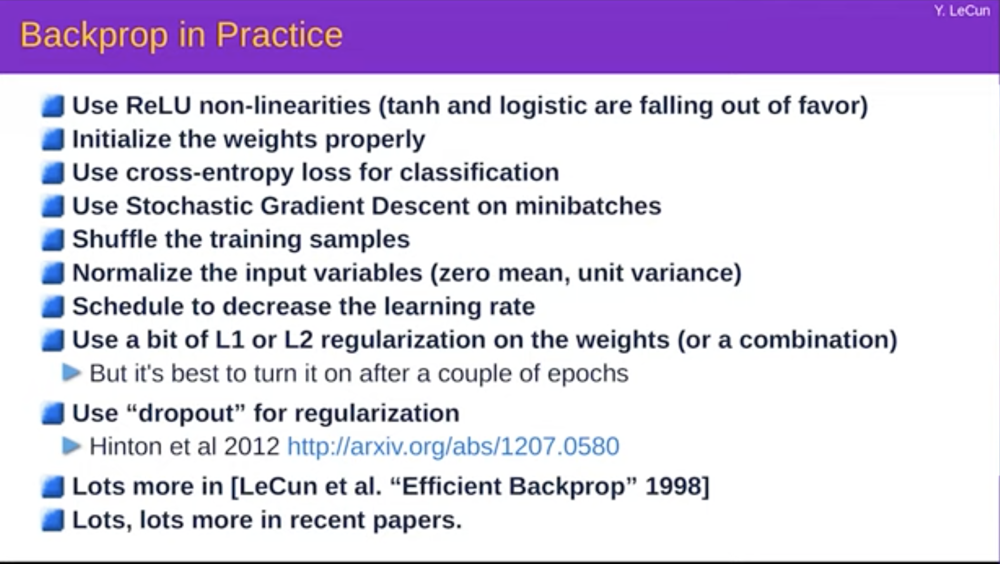
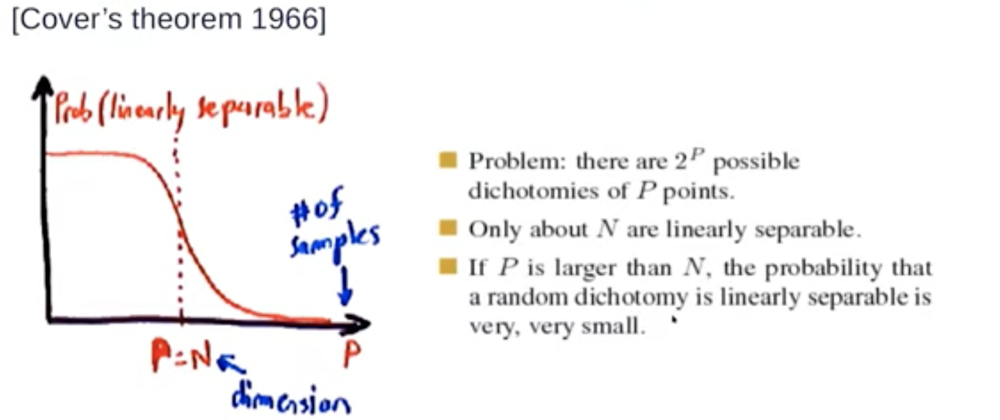
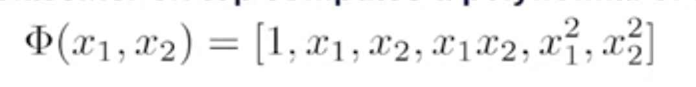
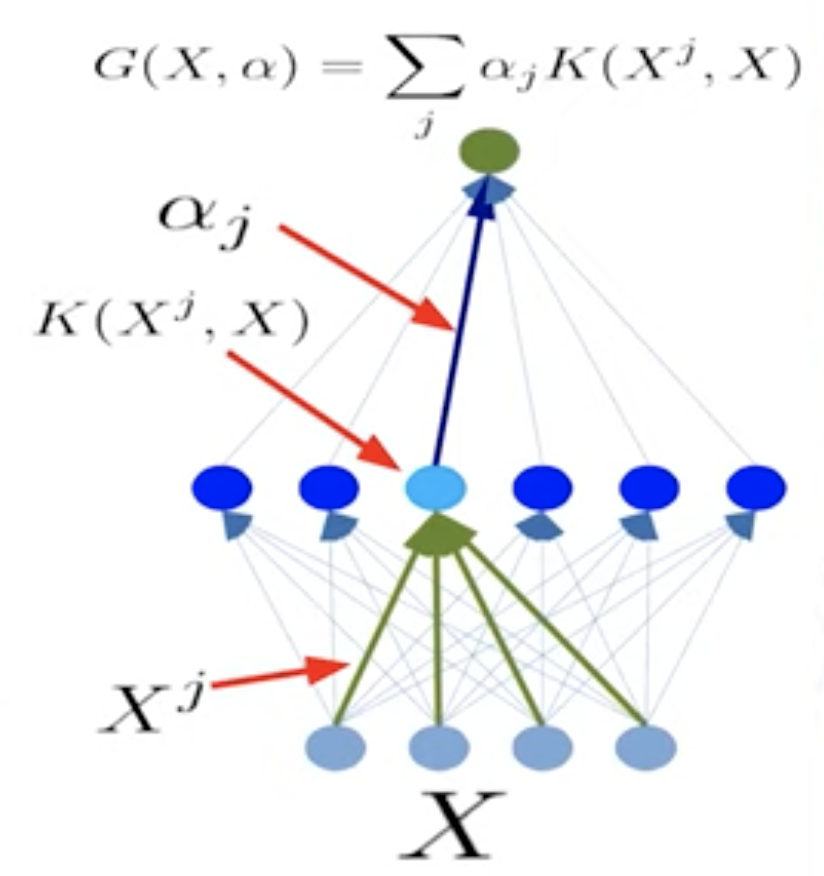

## First Lec

1. Some explanation of above
    1. initialize the weights properly
        1. to small random values
        2. Kaiming trick
            1. weighted sum of the unit of input variables
    2. optimization methods like sgd is sensitive to the range of the input variables 
        1. This means larger variables bring more sensitivity in the optimization than the smaller ones
        2. grdients being proportional to the input variables are  larger when input is large
        3. For large input variable relatively smaller larning rate has to be applied to reduce the divergence in the loss?
        4. input variance affects the divergence
        5. shifting the variables also affects
        6. So always normalize the input variables
    3. gradient free optimization methods or the zeroth order methods are useful mainly when
        1. terrain over which we are optimizing is not amenable - it is may be in the shape of a staircase so the gradient does not tell you where you are going
        2. if the input variables are discrete
        3. if the gradient is not possible to calculate but only get the loss
    4. Decrease the learning rate through the training process
        1. For reasons unknown, we have to start with a large learning rate in the beginning and decrease it allowing the system to settle around the minima
        2. mostly emperical
2. covers theorem 1966
    1. The probability that a dichotomy over P points in N dimensions is linearly separable goes to zero as P gets larger than N
    
    1. So if we are using a linear classifier preceded by featurization, the feature extractor has to be non linear as linear featurizer does not change the space like above and will not create a separable space
    2.  Inspired by the theorem people have come up with ideas to create a generic feature extractor
        1. Basic principle - expand the dimension of the representation so that things are more likely to become linearly separable
        2. space tiling
        3. random projections - the first layer of the network would project the input to many randomly choosen planes and non linearized
            1. hard to implement in many cases as it requires many such projections to reach the place where the points now become linearly separable
        4. polynomial classifier (feature cross products)
            1. feature extractor computes the cross products of input variables
                1. ex: monomial features
                2. 
                3. not practical for high dimensional ones
        5. kernel based classifiers like SVM
            1. Key idea - Create a new features one for each of the data point in the training set and use them to do the linear classifier
            2. It is like a two layer NN with first layer being kernels
                1. One example is the out nodes of this layer are same in number as the size of training sample. Each node represents a dot product of the new point with a training point then non linearize and add regularization to it.
                2. The second layer is a linear classifier with all the nodes for first layer
                3. 
                4. It is almost like a look up function of the training points and now depending on the location of the new point w.r.t training points we determine if the new point is one class
                5. Becomes very inefficient as the input dimensions or the training size increase
        6. Related to the above view there is a theorem that says that two layer networks are universal approximators of a well behaved function as long as we put sufficient number of nodes in the first layer
            1. Why go deep then - Because it is inefficient in many cases
3. The reason generally why more layers are good is because the world is generally compositional
    1. The layered network to an extent capture these
