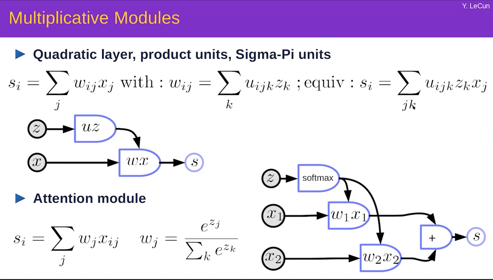
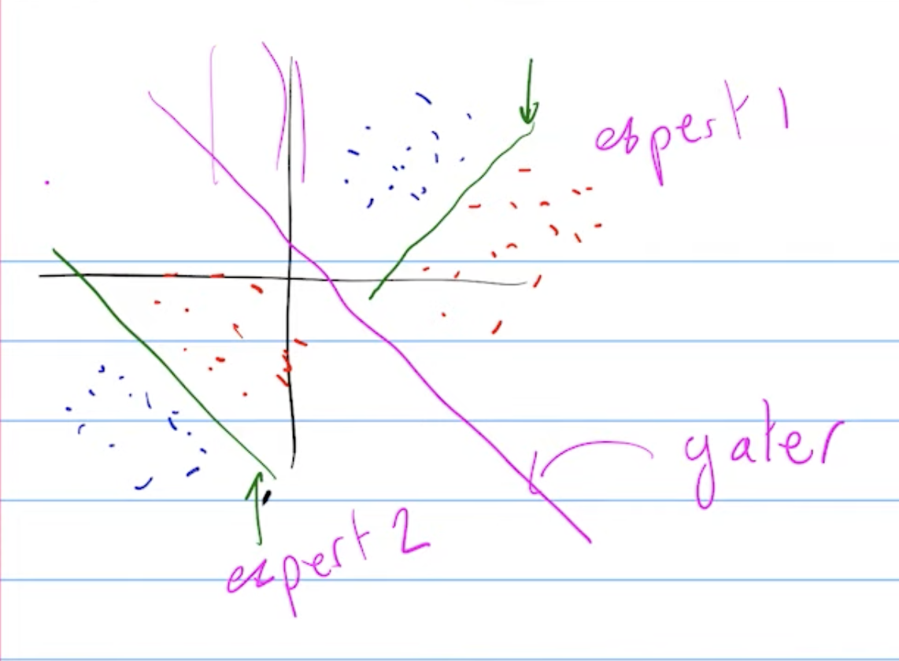
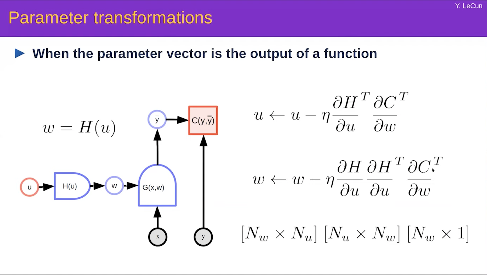
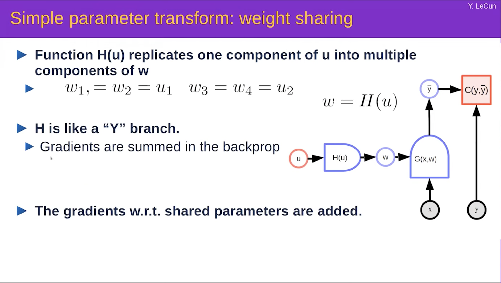
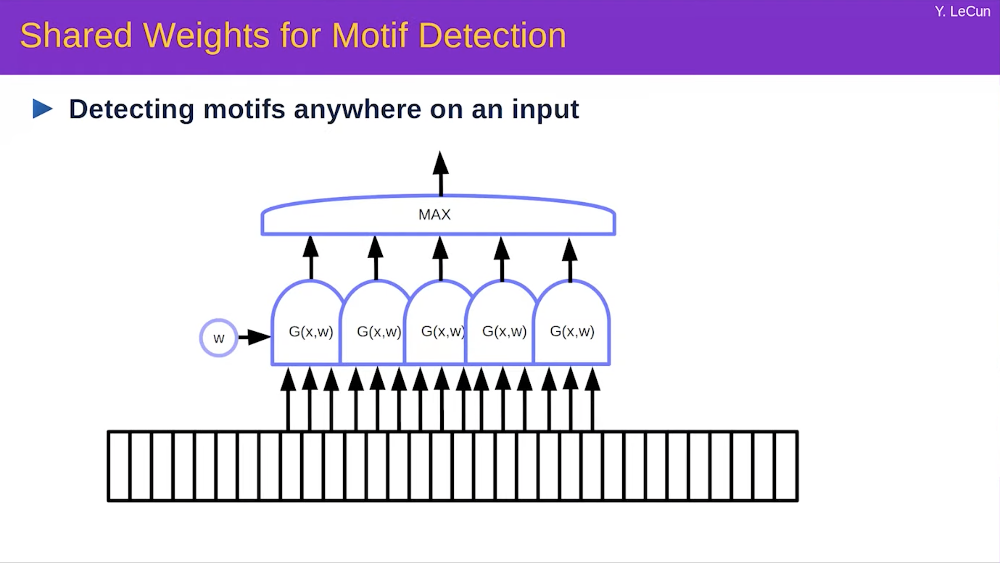
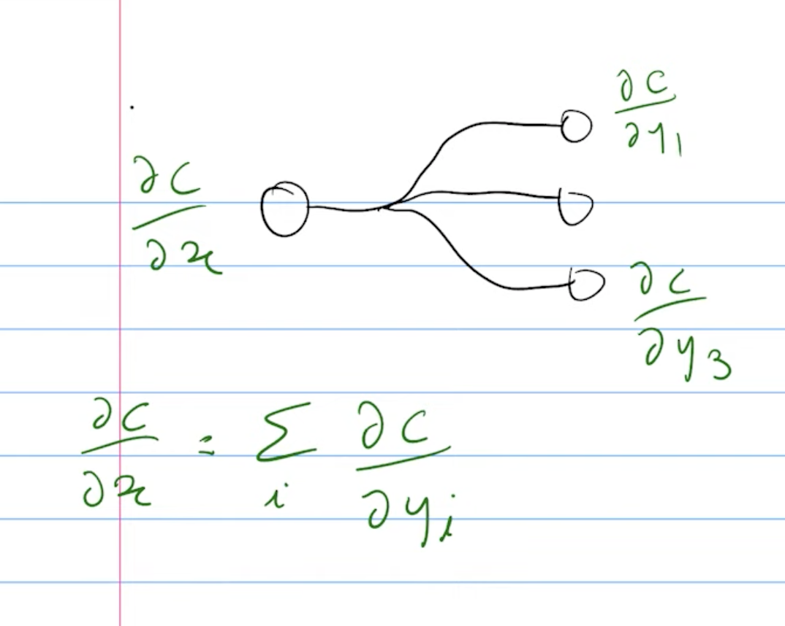

- The Linear transformation represented by matrix multiplication does a combination of the following
	1. Rotation
	2. Scaling
	3. Shearing
	4. Reflection
## Activation Functions
### Relu
1. Relu proportionately changes the output wrt the input and this makes the amplitude of the input signal not very important to the swing in the output
2. For such reasons or others we don't fully understand RelU are better for very deep networks
3. If all the nodes in the network have only Relu transformations then the output is a piece wise linear function of the input. In general the output is much easier to analyze with all Relus.
4. In some networks the Relus with all the zero gradients can cause problems because of zero gradient section in which case things like leaky relu is used
5. The way to think about Relu is it acts as a diode in an electrical system. The role of diode in a radio for instance is to detect if the signal is present (It gets activated with the signal). The Relu is acts in a similar way inside a network to activate a part of the network beyond a threshold. Relu is probably the simplest such diode as it lets the signal beyond to pass through fully and blocks anything below the threshold
### Leaky Relu, PRelu
### Softplus
1. Look at the extreme values of x to understand the curve
2. Transitions between 0 and Identity i.e. x
3. The speed of transition is dependent on the parameter beta
    1. Large beta means mostly like Relu with only small transition step
    2. Small beta means it has smoother transition
### GELU
1. Interesting twist on Relu with a non monotonic part in there
2. Such non monotonic ones are not preferred as they map multiple input points to the same output and backprop tends to get stuck in a saddle point or local mimina in such cases
    1. Taking the example of say, absolute value mod function as an activation function we know that for a given output the gradient descent can choose one of the two possible values of the input depending on the starting point. This is why the network can get stuck in local minima or saddle points
### Sigmoid/Logistic function/Fermi Dirac distribution
1. This is useful when we need a binary variable in the network like a switch that decides between A or B then sigmoid is a good fit as it lies between 0 and 1 and is smoothly transitioning and differentiable
2. Example is to use it to activate or deactivate a part of the network in a differentiable manner
3. Saturation problem explained below
### Tanh / Hyperbolic tangent
1. Disadvantage (Saturation problem): Similar to the sigmoid it is doesn't pass the gradient through it in the network when the input variable is large in amplitude (+,-)
2.  Advantage over sigmoid: As it is symmetric around 0 it can better make the variables to stay around zero mean than sigmoid or Relu which are not symmetric around 0. And we know that being around 0 is useful!
### Softmax
1. Ideally should be called softargmax
2. Converts a bunch of numbers to another bunch of numbers between 0 and 1 and sum to 1
	1. probability distribution over discrete outcomes
3. It essentially converts each of the numbers to exponential which are stricly positive and then convert them to probability by normalizing with their sum
4. If we take say softmax on two numbers $x_i$ and $x_j$. 
	$$softmax(x_j) = \frac{\exp(x_j)}{\exp(x_i)+\exp(x_j)}$$
    - Then we can take a special case where $x_i$ = 0 which converts the output from the softmax resembling the sigmoid
    $$softmax(x_j) = \frac{\exp(x_j)}{\exp(x_j)+1}$$
    $$softmax(x_j) = \frac{1}{1+\exp(-x_j)}$$
5. If all the $x_i$'s are all very small except $x_j$ for example then the softmax gives values close to 0 for all $x_i$ except $x_j$ which takes 1
    - Also the assignment of such is independent of the scale shift i.e. even if we move all the $x$'s 
    $$softmax(\vec{x} + \begin{bmatrix} c \\ c \\ c \\ c \\ c \\ \end{bmatrix})=softmax(\vec{x})$$
    - Thus it only cares about the relative values of x and not absolute values. So softargmax!
    - But the multiplication is not insensitive. So $softmax(\beta*\vec{x})$ has much drastic transition than the $softmax(\vec{x})$ when the $\beta$ is large. When all $x$'s are same and we increase in one of them then its value on application of $softmax$ quickly moves to 1 unlike when there is no $\beta$
    - When the softmax is put directly through the backprop it might happen that one of the $x$'s has much larger value than the others and hence it takes a value close to 1 for most of the range around the current value. This makes the gradient flow to stop. This is a problem. So when there is a log in the loss function that we need to apply later then we rather use logsoftmax which pulls back the scale of the numbers in $logsoftmax(x)$ to the original numbers $x$ 

## Cost Functions
### MSE
### L1 Norm
### NLL (Negative Log Likelihood Loss)
### BinaryCross Entropy Loss
### Margin Ranking Loss
- Only cares to separate the value of the correct class to be higher than the most closest incorrect class by a fixed margin. Hence only cares about the ranking!
## Architectures

- The above attention can be viewed as a special case of the quadratic layer.
- The Attention itself is nothing but a switch between $x_1$ and $x_2$. The switch is activated by the external $z$ and it is a soft switch because it is driven by a softmax on the $z$.
- One famous architecture related to such a switch module activated is Mixture of Experts like below

- The way the application works could be visualised in the below image where expert 1 is linear and able to separate the input in to red/blue class in a certain region. So is expert 2 but in a different region. The gater first determines which expert to call and then is able to successfully able to separate in all of the region. This the gater does by splitting the input space as shown by the pink line.

- Below we illustrate the concept of parameter trasform where w being the parameters of the network G are coming from a different network H as a function of u. So while we are doing the parametr update for u we get to do the parameter update in gradient descent for w as well.

- The below image illustrates different concept of weight sharing. And H could be assumed like a duplication layer that copies the values of u to a vector of required size.

- An example of such a weight sharing is when we want to detect a motif in a sequence of inputs. Motif could be a phrase in voice signal or a face in an image, etc. It is like almost we are applying a single neural network at all places of the sequence. Instead it could be modelled like below as a max of all the places in the sequence where we apply the weight shared nn.

- At the prediction time such a motif could be identified in real time by moving across the sequence and applying one $G(x, w)$ at each place. But at train time we only know approximately where the motif occurs and do not know the exact place where it occurs. So we create multiple copies of the same network as above and apply a max operator to model the motif.
    - The max acts like a switch and transfers the gradient to the appropriate network at the time of optimization
    - Softmax could also be applied that would transfer the gradient to all the network copies but in a soft manner.
    - Since the $w$ are only copies the gradient that totally gets applied at gradient descent is the sum of gradients collected for the $w$ at each network. Below is a one parameter illustration
    
    - In the figure above the $x$ got branched in to $y1$ to $y3$ say in the form of copies. Then the final $\frac{\partial c}{\partial x} = \sum_{i}\frac{\partial c}{\partial y_i}$ is how the gradient accumulation occurs in case the parameter is just copied.
    - That is to say when the parameter is copied in forward prop then sum has to be applied in the backward prop. In fact the vice versa is also true that if we sum the parameters in the forward prop then the gradient just has to be copied to the individual parameters in the backward prop!
