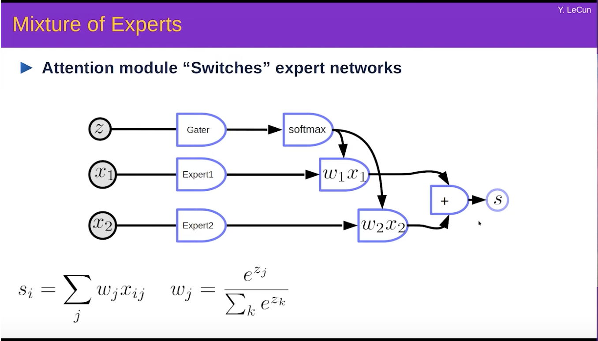

### Softmax
1. Ideally should be called softargmax
2. Converts a bunch of numbers to another bunch of numbers between 0 and 1 and sum to 1
	1. probability distribution over discrete outcomes
3. It essentially converts each of the numbers to exponential which are stricly positive and then convert them to probability by normalizing with their sum
4. If we take say softmax on two numbers $x_i$ and $x_j$. 
	$$softmax(x_j) = \frac{\exp(x_j)}{\exp(x_i)+\exp(x_j)}$$
    - Then we can take a special case where $x_i$ = 0 which converts the output from the softmax resembling the sigmoid
    $$softmax(x_j) = \frac{\exp(x_j)}{\exp(x_j)+1}$$
    $$softmax(x_j) = \frac{1}{1+\exp(-x_j)}$$
5. If all the $x_i$'s are all very small except $x_j$ for example then the softmax gives values close to 0 for all $x_i$ except $x_j$ which takes 1
    - Also the assignment of such is independent of the scale shift i.e. even if we move all the $x$'s 
    $$softmax(\vec{x} + \begin{bmatrix} c \\ c \\ c \\ c \\ c \\ \end{bmatrix})=softmax(\vec{x})$$
    - Thus it only cares about the relative values of x and not absolute values. So softargmax!
    - But the multiplication is not insensitive. So $softmax(\beta*\vec{x})$ has much drastic transition than the $softmax(\vec{x})$ when the $\beta$ is large. When all $x$'s are same and we increase in one of them then its value on application of $softmax$ quickly moves to 1 unlike when there is no $\beta$
    - When the softmax is put directly through the backprop it might happen that one of the $x$'s has much larger value than the others and hence it takes a value close to 1 for most of the range around the current value. This makes the gradient flow to stop. This is a problem. So when there is a log in the loss function that we need to apply later then we rather use logsoftmax which pulls back the scale of the numbers in $logsoftmax(x)$ to the original numbers $x$ 

## Cost Functions
### MSE
### L1 Norm
### NLL (Negative Log Likelihood Loss)
### BinaryCross Entropy Loss
### Margin Ranking Loss
- Only cares to separate the value of the correct class to be higher than the most closest incorrect class by a fixed margin. Hence only cares about the ranking!
## Architectures

- The above attention can be viewed as a special case of the quadratic layer.
- The Attention itself is nothing but a switch between $x_1$ and $x_2$. The switch is activated by the external $z$ and it is a soft switch because it is driven by a softmax on the $z$.
- One famous architecture related to such a switch module activated is Mixture of Experts like below

- The way the application works could be visualised in the below image where expert 1 is linear and able to separate the input in to red/blue class in a certain region. So is expert 2 but in a different region. The gater first determines which expert to call and then is able to successfully able to separate in all of the region. This the gater does by splitting the input space as shown by the pink line.

Below we illustrate the concept of parameter trasform where w being the parameters of the network G are coming from a different network H as a function of u. So while we are doing the parametr update for u we get to do the parameter update in gradient descent for w as well.

The below image illustrates different concept of weight sharing. And H could be assumed like a duplication layer that copies the values of u to a vector of required size.

An example of such a weight sharing is when we want to detect a motif in a sequence of inputs. Motif could be a phrase in voice signal or a face in an image, etc. It is like almost we are applying a single neural network at all places of the sequence. Instead it could be modelled like below as a max of all the places in the sequence where we apply the weight shared nn.

