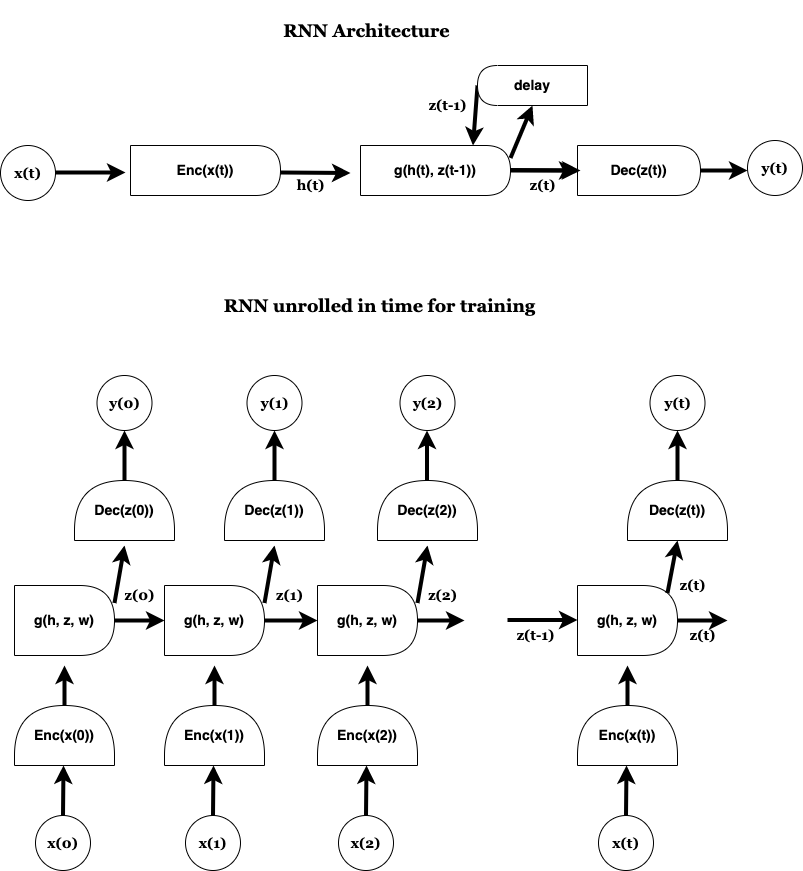
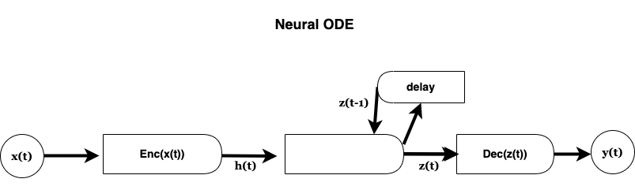
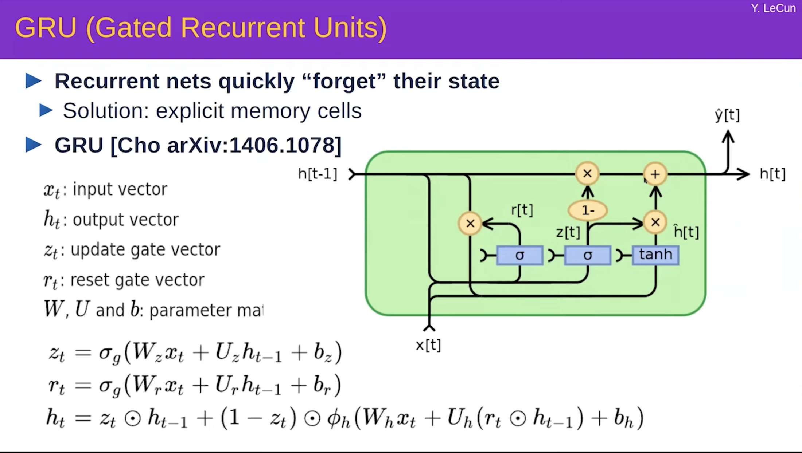
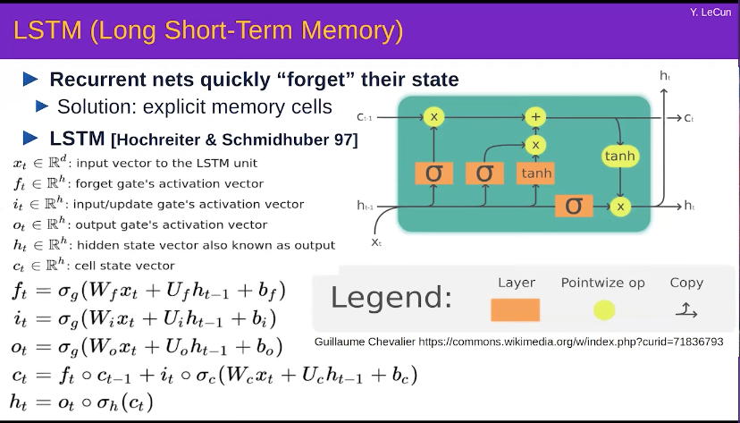

## RNN
- The RNN is essentially a neural network with delay time added while predicting the output
- For the backprop to work the network needs to be acyclic graph. But the delay connection like below makes the network have cycles. The solution to the problem is to unroll the network across time and do the training.
- The Encoder, $g$ and Decoder have shared parameters (are the same) across time. So the gradients with respect to the parameters is just summation across the gradients from each time step for the respective network i.e. either encoder, decoder, $g$.
    -  This follows from the shared parameter logic that final gradient at the time of backprop for a shared parameter is the sum of gradients from each copy. Explained in the previous lecture.

### Vanishing and Exploding gradients
- The sequences over which the rnn is applied are typically thousands of instances in length. In such scenarios the input vector gets passed through many transformations which are matrix multiplications. There could be non linearities applied between one instance and the other. 
- In such a case if the transformations are like rotations which do not strectch or shrink the vector (increase of decrease its norm) then norm of the vector and its effect in terms of its norm gets preserved during the forward pass to the layers much ahead in time.
    - The gradients in such a scenario during backprop also preserve their norm across the layers
- In different scenarios like when the norm of the transformation equivalent matrix is < 0, the norm of the input gets shrinked as it traverses through the layers and leading to negligible contributon in a few time steps.
    - Since the matrix applied during backprop is transpose of the matrix transformation in the forward prop, the gradient flow also stops because the gradient becomes equally small in a few time steps. Detailed example on backprop calculation is given in the subsection
- Similarly if the norm of the transformation matrix > 0 we encounter exploding gradients problem during the backprop. This leads to very large gradients from the output in the backwards direction as distance to output increses.
    - The nonlinerarity like sigmoid could reduce the exploding gradient problem to an extant
#### Neural Network Backpropagation Example
- Forward Pass
    - Given our input matrix:
    $$ X = \begin{bmatrix} x_1 \\ x_2 \end{bmatrix} $$
    
    - And our weight matrices:
    $$ W_1 = \begin{bmatrix} w_{11} & w_{12} \\ w_{21} & w_{22} \end{bmatrix} $$
    $$ W_2 = \begin{bmatrix} w_{31} & w_{32} \end{bmatrix} $$

    - We can compute the hidden layer activations as:
    $$ A_1 = W_1 \times X $$
    
    - Then, the output of the network is:
    $$ \hat{y} = W_2 \times A_1 $$

- Backward Pass
    - For the mean squared error loss, the formula is:
    $$ E = \frac{1}{2} (y - \hat{y})^2 $$

    - The gradient of this error with respect to the network's output is:
    $$ \frac{\partial E}{\partial \hat{y}} = \hat{y} - y $$

    - To compute the gradient with respect to the weights in $W_2$:
    $$ \frac{\partial E}{\partial W_2} = \frac{\partial E}{\partial \hat{y}} \times A_1^T $$
 
    - Notice how we're multiplying by the transpose of $A_1$ due to matrix multiplication rules and dimensions.

    - Finally, for the weights in $W_1$, we use the chain rule of derivatives:
    $$ \frac{\partial E}{\partial W_1} = (\hat{y} - y) \times W_2^T \times X^T $$
- This demonstrates that during the backward pass, we use the transposed matrices to correctly propagate the error and compute the gradients.
### Neural ODE
- These are just a different form of rnn. They are modelled for the ode. Let us say we want to model the state $x_t$ (like position) of a system which knows to obtain as an differential equation in the hidden state $z_t$ (like momemtum and position). 
- The approach to model using NN is to discretize in the time and use the network to update the state.
- The equation being modeled is $$\frac{dz}{dt} = g(h(t), z(t), w)$$

- The equations are 
$$h(t) = Enc(x(t))$$
$$z(t) = z(t-\delta t) + g(h(t), z(t-\delta t), w) \delta t$$
$$y(t) = Dec(z(t))$$
- So essentially instead of a $g$ applied in between for predicting the next hidden state in the rnn, in case of neural ode this $g$ is used to predict the difference in the hidden states between time.

### GRU
- Since the RNN quickly forgets the previous state information because of the gradient vanishing or explosion problem, we can privde an explicit memory cell as below

- As above, the idea is to allow the $h_t$ to pass through the cell by default except it gets modified by the new information from the $tanh$ component.
- The gate is implemented using the multiplicative layer passing the output from the sigmoid layer. Since sigmoid it is between 0 and 1 and acts like a soft gate. When the value is zero the previous state $h_{t-1}$ is essentially forgotten and only the new information from the tanh is passed to next time.
- Please note the notation got switched between $z$ and $h$ from the rnn diagram/discussion

### LSTM
- Another explicit memory cell

- Similar but slightly different than FRU

## Convolutional Networks

